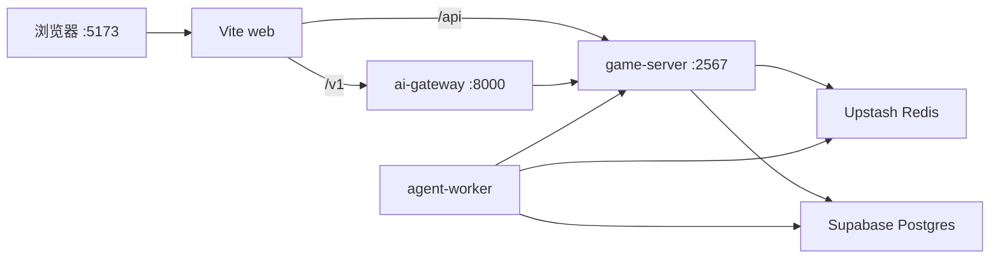

# AetherLife / 以太人生

[](https://github.com/moyunzero/AetherLife/actions/workflows/ci.yml)

AI 驱动的多人联机生活模拟 Web 游戏：与拥有记忆的 NPC 用自然语言互动，在可扩展的程序化世界中移动、协作与叙事。

## 特性

- **多人联机** — Colyseus 权威同步，最多 4 人同房间
- **自然语言指挥** — 通过 ai-gateway 解析意图，worker 异步执行 NPC 回合
- **持久记忆** — Postgres + pgvector，NPC 会记住互动并影响后续行为
- **Phaser 4 世界** — 2D 像素「地球Online」风：网格移动、程序化 chunk 地形与世界 lore
- **智能 Ambient NPC（v3）** — schedule/zone 漫游、异步 LLM intent 副行、Tiled 碰撞与 village-plaza 跨区（Phase 16）
- **Speak SLA（v3）** — worker-state / memory-context 缓存、stale fallback、并行 speak 多 Tab 不丢回复（Phase 17 / ISSUE-048）
- **集体态度** — NPC 对玩家/群体的态度随行为演化（Phase 12+）

## 技术栈

| 层 | 技术 |
|----|------|
| 客户端 | React 19 · Vite · Phaser 4 |
| 实时 | Colyseus · SSE |
| AI | LangGraph worker · FastAPI gateway |
| 数据 | Supabase Postgres · Upstash Redis |

Monorepo：`apps/web` · `apps/game-server` · `apps/ai-gateway` · `workers/agent-worker` · `packages/*`

## 快速开始

### 前置条件

- Node.js 20+、pnpm 9+（`corepack enable && corepack prepare pnpm@9.15.0 --activate`）
- [Supabase](https://supabase.com) 项目（Postgres + `CREATE EXTENSION vector`）
- [Upstash](https://upstash.com) Redis
- Python 3.12+、[uv](https://docs.astral.sh/uv/)（ai-gateway / worker）
- LLM API Key（见 `.env.example`；生产默认 **NVIDIA NIM** + OpenRouter embed）

### 安装与启动

```bash
git clone https://github.com/moyunzero/AetherLife.git
cd AetherLife
pnpm install
cp .env.example .env   # 填入 DATABASE_URL、REDIS_URL、LLM 密钥
pnpm verify:cloud
pnpm --filter @aetherlife/npc-memory db:migrate
cd apps/ai-gateway && uv sync --extra dev && cd ../..
pnpm dev:stack
```

浏览器打开 **http://localhost:5173**。`Ctrl+C` 停止全部本地进程。

> 无需本地 Postgres/Redis — 开发默认使用 Supabase + Upstash 云实例。  
> UI 冒烟可用 `pnpm dev:stack:mock`；**phase 验收脚本须真实 LLM**（`pnpm dev:stack`，禁止 `LLM_MOCK=1`）。

### 健康检查

```bash
curl -sf http://127.0.0.1:5173/
curl -sf http://127.0.0.1:2567/health
curl -sf http://127.0.0.1:8000/health
```

## 架构



| 服务 | 端口 | 职责 |
|------|------|------|
| web | 5173 | UI；代理 `/v1` → gateway、`/api` → game-server |
| game-server | 2567 | Colyseus 房间、SSE、记忆 API |
| ai-gateway | 8000 | NL 解析、输入审核、chat 入口 |
| agent-worker | — | Redis 队列消费，NPC LangGraph 回合 |

分终端调试：`pnpm dev` · `pnpm dev:ai` · `pnpm dev:worker`（等价于 `pnpm dev:stack`）。

## 测试

```bash
pnpm turbo test
pnpm turbo build
pnpm verify          # build + test + verify:cloud
pnpm agent:verify    # diff → mapped unit tests (mock LLM OK)

# 跨层单测（可 mock LLM）
pnpm --filter @aetherlife/game-server test
cd workers/agent-worker && LLM_MOCK=1 uv run pytest -q
cd apps/ai-gateway && uv run pytest tests -q
```

Phase 集成验收（需 `pnpm dev:stack` + 真实 API Key）：见 [CONTRIBUTING.md](./CONTRIBUTING.md#集成验收)。  
v3 Speak SLA / Golden Flows：`pnpm agent:verify --e2e --base`（见 [docs/E2E-POLICY.md](./docs/E2E-POLICY.md)）。

Action schema：[packages/game-actions/README.md](./packages/game-actions/README.md)

## 文档

| 文档 | 说明 |
|------|------|
| [CONTRIBUTING.md](./CONTRIBUTING.md) | 协作流程、约束与验收命令 |
| [docs/CONTRACTS.md](./docs/CONTRACTS.md) | game-server ↔ worker API 契约 |
| [docs/INVARIANTS-MULTIPLAYER.md](./docs/INVARIANTS-MULTIPLAYER.md) | 多人空间与 NL 不变量 |
| [docs/MOVEMENT-ARCHITECTURE.md](./docs/MOVEMENT-ARCHITECTURE.md) | Phaser 移动与 Colyseus 同步 |
| [docs/E2E-POLICY.md](./docs/E2E-POLICY.md) | E2E / UAT 策略与 Golden Flows |
| [docs/PHASE-EVOLUTION.md](./docs/PHASE-EVOLUTION.md) | 阶段演进与跨层防债务 |

## 贡献

欢迎 Issue 与 PR。请先阅读 [CONTRIBUTING.md](./CONTRIBUTING.md)。请勿提交 `.env` 或 API 密钥。

## License

[MIT](./LICENSE)
