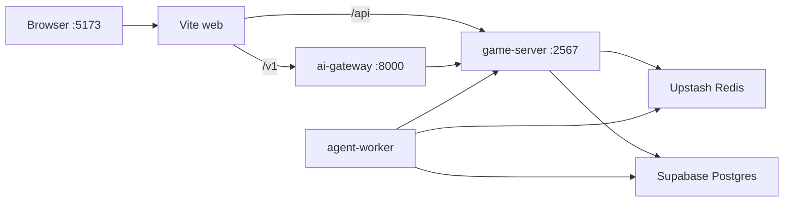

# AetherLife

[](https://github.com/moyunzero/AetherLife/actions/workflows/ci.yml)
[](./LICENSE)

**English** | [简体中文](./README.zh-CN.md)

AI-driven multiplayer life-simulation web game: guide memory-bearing NPCs through natural language in a procedural pixel world. Colyseus handles authoritative sync; LangGraph workers run async NPC turns with persistent pgvector memory.

## Table of Contents

- [About](#about)
- [Project Status](#project-status)
- [Demo](#demo)
- [Features](#features)
- [Tech Stack](#tech-stack)
- [Quick Start](#quick-start)
- [Architecture](#architecture)
- [Testing](#testing)
- [Documentation](#documentation)
- [Contributing](#contributing)
- [License](#license)

## About

Players explore a Stardew-inspired 2D world, discover LLM-generated lore, and shape NPC collective attitudes through dialogue and actions. The core loop—**perceive → remember → reflect → act**—must be verifiable in every session. Since v4, quest-strip UI was removed in favor of ambient world echo.

**Target audience:** Life-sim fans (*The Sims*, *Animal Crossing*, *Minecraft*), AI enthusiasts, and narrative-driven multiplayer players.

## Project Status

| Milestone | Phases | Status | Shipped |
|-----------|--------|--------|---------|
| **v0** Phase 0 text loop | 01–05 | ✅ Shipped | 2026-06-04 |
| **v1** Graphics + multiplayer + world | 06–08, 10–12.1 (09 deferred) | ✅ Shipped | 2026-06-07 |
| **v2** Playable AI town | 12.2–15 | ✅ Shipped | 2026-06-09 |
| **v3** Intelligent ambient + Speak SLA | 16–17.1, 18 | ✅ Shipped | 2026-06-11 |
| **v4** Solo life loop | 19–22 | ✅ Shipped | 2026-06-22 |
| **v5** AI Society / Council Worldview | 23–27 | 🔨 In progress | Phase 23 ✅ (2026-06-25) |
| **Deferred** Voice pipeline | 09 | ⏸ Deferred | — |

Phases 24–27 (world chronicle, council vote/debate, 12-NPC map presence, personal life timeline) are planned.

→ **[Development History](./docs/DEVELOPMENT-HISTORY.md)** · [简体中文](./docs/DEVELOPMENT-HISTORY.zh-CN.md)

## Demo

| | |
|---|---|
| **Local** | [http://localhost:5173](http://localhost:5173) — run `pnpm dev:stack` |
| **Screenshots** | _Coming soon_ |
| **Public deploy** | _Not yet available_ |

## Features

- **Multiplayer** — Colyseus authoritative sync, up to 4 players per room
- **Natural language** — ai-gateway parses intent; worker runs async NPC turns
- **Persistent memory** — Postgres + pgvector; NPCs remember and adapt
- **Phaser 4 world** — Grid movement, procedural chunks, world lore
- **Intelligent ambient NPCs (v3)** — Schedule/zone wander, async LLM intent, Tiled collision
- **Speak SLA (v3)** — worker-state cache, stale fallback, multi-tab speak
- **Collective attitude** — NPC group attitude evolves with player behavior
- **Council personas (v5)** — 12-NPC registry, `__council__` memory scope (Phase 23)

## Tech Stack

| Layer | Technology |
|-------|------------|
| Client | React 19 · Vite · Phaser 4 |
| Realtime | Colyseus · SSE |
| AI | LangGraph worker · FastAPI gateway |
| Data | Supabase Postgres · Upstash Redis |

Monorepo: `apps/web` · `apps/game-server` · `apps/ai-gateway` · `workers/agent-worker` · `packages/*`

## Quick Start

### Prerequisites

- Node.js 20+, pnpm 9+ (`corepack enable && corepack prepare pnpm@9.15.0 --activate`)
- [Supabase](https://supabase.com) project (Postgres + `CREATE EXTENSION vector`)
- [Upstash](https://upstash.com) Redis
- Python 3.12+, [uv](https://docs.astral.sh/uv/) (ai-gateway / worker)
- LLM API keys (see `.env.example`; production defaults to **NVIDIA NIM** + OpenRouter embed)

### Install & run

```bash
git clone https://github.com/moyunzero/AetherLife.git
cd AetherLife
pnpm install
cp .env.example .env   # fill DATABASE_URL, REDIS_URL, LLM keys
pnpm verify:cloud
pnpm --filter @aetherlife/npc-memory db:migrate
cd apps/ai-gateway && uv sync --extra dev && cd ../..
pnpm dev:stack
```

Open **http://localhost:5173** in your browser. Press `Ctrl+C` to stop all local processes.

> No local Postgres/Redis required — dev uses Supabase + Upstash cloud.  
> UI smoke: `pnpm dev:stack:mock`. Phase verification scripts require **real LLM** (`pnpm dev:stack`, never `LLM_MOCK=1`).

### Health checks

```bash
curl -sf http://127.0.0.1:5173/
curl -sf http://127.0.0.1:2567/health
curl -sf http://127.0.0.1:8000/health
```

## Architecture



| Service | Port | Role |
|---------|------|------|
| web | 5173 | UI; proxies `/v1` → gateway, `/api` → game-server |
| game-server | 2567 | Colyseus rooms, SSE, memory API |
| ai-gateway | 8000 | NL parse, input guard, chat ingress |
| agent-worker | — | Redis queue consumer, LangGraph NPC turns |

Per-terminal debug: `pnpm dev` · `pnpm dev:ai` · `pnpm dev:worker` (equivalent to `pnpm dev:stack`).

## Testing

```bash
pnpm turbo test
pnpm turbo build
pnpm verify          # build + test + verify:cloud
pnpm agent:verify    # diff → mapped unit tests (mock LLM OK)

# Cross-layer unit tests (mock LLM OK)
pnpm --filter @aetherlife/game-server test
cd workers/agent-worker && LLM_MOCK=1 uv run pytest -q
cd apps/ai-gateway && uv run pytest tests -q
```

Phase integration gates require `pnpm dev:stack` + real API keys — see [CONTRIBUTING.md](./CONTRIBUTING.md#集成验收). Golden flows: `pnpm agent:verify --e2e --base` ([E2E-POLICY.md](./docs/E2E-POLICY.md)).

Action schema: [packages/game-actions/README.md](./packages/game-actions/README.md)

## Documentation

| Document | Description |
|----------|-------------|
| **[Development History](./docs/DEVELOPMENT-HISTORY.md)** | All 37 phases: timeline, rationale, status, verify gates |
| [CONTRIBUTING.md](./CONTRIBUTING.md) | Workflow, constraints, acceptance commands |
| [docs/CONTRACTS.md](./docs/CONTRACTS.md) | game-server ↔ worker API contracts |
| [docs/INVARIANTS-MULTIPLAYER.md](./docs/INVARIANTS-MULTIPLAYER.md) | Multiplayer spatial + NL invariants |
| [docs/MOVEMENT-ARCHITECTURE.md](./docs/MOVEMENT-ARCHITECTURE.md) | Phaser movement + Colyseus sync |
| [docs/E2E-POLICY.md](./docs/E2E-POLICY.md) | E2E / UAT policy + Golden Flows |
| [docs/PHASE-EVOLUTION.md](./docs/PHASE-EVOLUTION.md) | Phase evolution + cross-layer guardrails |
| [docs/COUNCIL-PERSONAS.md](./docs/COUNCIL-PERSONAS.md) | 12-seat council persona SSOT + export/audit |

## Contributing

Issues and PRs welcome. Read [CONTRIBUTING.md](./CONTRIBUTING.md) first. Never commit `.env` or API keys.

## License

[MIT](./LICENSE)
