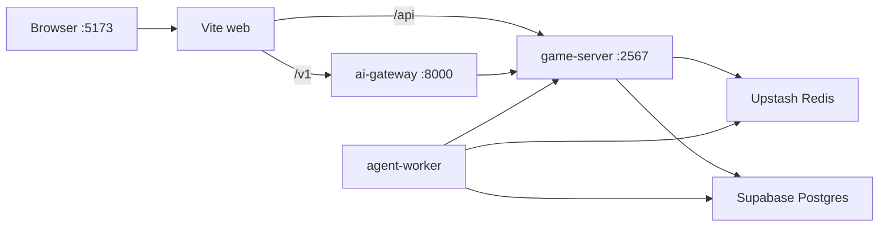

# AetherLife / 以太人生

[](https://github.com/moyunzero/AetherLife/actions/workflows/ci.yml)
[](./LICENSE)

> **EN:** AetherLife is a multiplayer life-simulation web game where you guide memory-bearing NPCs through natural language in a procedural pixel world. Colyseus handles authoritative sync; LangGraph workers run async NPC turns with persistent pgvector memory.
>
> **中文：** AetherLife 是一款 AI 驱动的多人联机生活模拟 Web 游戏。玩家用自然语言指挥拥有持久记忆的 NPC，在 Phaser 4 程序化世界中探索与叙事；Colyseus 权威同步，LangGraph worker 异步执行 NPC 回合。

## Table of Contents / 目录

- [About / 项目简介](#about--项目简介)
- [Project Status / 项目状态](#project-status--项目状态)
- [Demo / 演示](#demo--演示)
- [Features / 特性](#features--特性)
- [Tech Stack / 技术栈](#tech-stack--技术栈)
- [Quick Start / 快速开始](#quick-start--快速开始)
- [Architecture / 架构](#architecture--架构)
- [Testing / 测试](#testing--测试)
- [Documentation / 文档](#documentation--文档)
- [Contributing / 贡献](#contributing--贡献)
- [License](#license)

## About / 项目简介

**EN:** Players explore a Stardew-inspired 2D world, discover LLM-generated lore, and shape NPC collective attitudes through dialogue and actions. The core loop—**perceive → remember → reflect → act**—must be verifiable in every milestone removed from quest-strip UI in favor of ambient world echo.

**中文：** 玩家在星露谷式 2D 世界中探索、发现 LLM 注入的区块 lore，并通过对话与行为影响 NPC 对群体的集体态度。核心闭环——**感知 → 记忆 → 反思 → 执行**——须在每次会话中可验证；v4 起移除任务条 UI，改为 ambient 世界回响。

**Target audience / 目标用户:** Life-sim fans (*The Sims*, *Animal Crossing*, *Minecraft*), AI enthusiasts, and narrative-driven multiplayer players.

## Project Status / 项目状态

| Milestone | Phases | Status | Shipped |
|-----------|--------|--------|---------|
| **v0** Phase 0 text loop | 01–05 | ✅ Shipped / 已交付 | 2026-06-04 |
| **v1** Graphics + multiplayer + world | 06–08, 10–12.1 (09 deferred) | ✅ Shipped | 2026-06-07 |
| **v2** Playable AI town | 12.2–15 | ✅ Shipped | 2026-06-09 |
| **v3** Intelligent ambient + Speak SLA | 16–17.1, 18 | ✅ Shipped | 2026-06-11 |
| **v4** Solo life loop | 19–22 | ✅ Shipped | 2026-06-22 |
| **v5** AI Society / Council Worldview | 23–27 | 🔨 In progress / 进行中 | Phase 23 ✅ (2026-06-25) |
| **Deferred** Voice pipeline | 09 | ⏸ Deferred / 暂缓 | — |

**EN:** Phase 24–27 (world chronicle, council vote/debate, 12-NPC map presence, personal life timeline) are planned. See the full development history for every phase, decision, and verification gate.

**中文：** Phase 24–27（世界编年史、议会辩论表决、12 NPC 上地图、个人人生时间线）规划中。完整 37 个 Phase 的开发时间、思路、状态与验收命令见开发历程文档。

→ **[Development History / 开发历程](./docs/DEVELOPMENT-HISTORY.md)**

## Demo / 演示

| | |
|---|---|
| **Local / 本地** | [http://localhost:5173](http://localhost:5173) — run `pnpm dev:stack` |
| **Screenshots / 截图** | _Coming soon / 即将补充_ |
| **Public deploy / 公网部署** | _Not yet available / 暂无_ |

## Features / 特性

| EN | 中文 |
|----|------|
| **Multiplayer** — Colyseus authoritative sync, up to 4 players per room | **多人联机** — Colyseus 权威同步，最多 4 人同房间 |
| **Natural language** — ai-gateway parses intent; worker runs async NPC turns | **自然语言指挥** — ai-gateway 解析意图，worker 异步执行 NPC 回合 |
| **Persistent memory** — Postgres + pgvector; NPCs remember and adapt | **持久记忆** — Postgres + pgvector，NPC 记住互动并影响后续行为 |
| **Phaser 4 world** — Grid movement, procedural chunks, world lore | **Phaser 4 世界** — 网格移动、程序化 chunk 地形与世界 lore |
| **Intelligent ambient NPCs (v3)** — Schedule/zone wander, async LLM intent, Tiled collision | **智能 Ambient NPC（v3）** — schedule/zone 漫游、异步 LLM intent、Tiled 碰撞 |
| **Speak SLA (v3)** — worker-state cache, stale fallback, multi-tab speak | **Speak SLA（v3）** — worker-state / memory-context 缓存、stale fallback、多 Tab speak |
| **Collective attitude** — NPC group attitude evolves with player behavior | **集体态度** — NPC 对玩家/群体的态度随行为演化 |
| **Council personas (v5)** — 12-NPC registry, `__council__` memory scope (Phase 23) | **议会人格（v5）** — 12 人 registry、`__council__` 记忆 scope（Phase 23） |

## Tech Stack / 技术栈

| Layer / 层 | Technology / 技术 |
|------------|-------------------|
| Client / 客户端 | React 19 · Vite · Phaser 4 |
| Realtime / 实时 | Colyseus · SSE |
| AI | LangGraph worker · FastAPI gateway |
| Data / 数据 | Supabase Postgres · Upstash Redis |

Monorepo: `apps/web` · `apps/game-server` · `apps/ai-gateway` · `workers/agent-worker` · `packages/*`

## Quick Start / 快速开始

### Prerequisites / 前置条件

- Node.js 20+, pnpm 9+ (`corepack enable && corepack prepare pnpm@9.15.0 --activate`)
- [Supabase](https://supabase.com) project (Postgres + `CREATE EXTENSION vector`)
- [Upstash](https://upstash.com) Redis
- Python 3.12+, [uv](https://docs.astral.sh/uv/) (ai-gateway / worker)
- LLM API keys (see `.env.example`; production defaults to **NVIDIA NIM** + OpenRouter embed)

### Install & run / 安装与启动

```bash
git clone https://github.com/moyunzero/AetherLife.git
cd AetherLife
pnpm install
cp .env.example .env   # fill DATABASE_URL, REDIS_URL, LLM keys
pnpm verify:cloud
pnpm --filter @aetherlife/npc-memory db:migrate
cd apps/ai-gateway && uv sync --extra dev && cd ../..
pnpm dev:stack
```

Open **http://localhost:5173** in your browser. Press `Ctrl+C` to stop all local processes.

**EN:** No local Postgres/Redis required — dev uses Supabase + Upstash cloud. UI smoke: `pnpm dev:stack:mock`. Phase verification scripts require **real LLM** (`pnpm dev:stack`, never `LLM_MOCK=1`).

**中文：** 无需本地 Postgres/Redis — 开发默认使用 Supabase + Upstash 云实例。UI 冒烟可用 `pnpm dev:stack:mock`；**phase 验收脚本须真实 LLM**（`pnpm dev:stack`，禁止 `LLM_MOCK=1`）。

### Health checks / 健康检查

```bash
curl -sf http://127.0.0.1:5173/
curl -sf http://127.0.0.1:2567/health
curl -sf http://127.0.0.1:8000/health
```

## Architecture / 架构



| Service / 服务 | Port / 端口 | Role / 职责 |
|----------------|-------------|-------------|
| web | 5173 | UI; proxies `/v1` → gateway, `/api` → game-server |
| game-server | 2567 | Colyseus rooms, SSE, memory API |
| ai-gateway | 8000 | NL parse, input guard, chat ingress |
| agent-worker | — | Redis queue consumer, LangGraph NPC turns |

Per-terminal debug / 分终端调试: `pnpm dev` · `pnpm dev:ai` · `pnpm dev:worker` (equivalent to `pnpm dev:stack`).

## Testing / 测试

```bash
pnpm turbo test
pnpm turbo build
pnpm verify          # build + test + verify:cloud
pnpm agent:verify    # diff → mapped unit tests (mock LLM OK)

# Cross-layer unit tests (mock LLM OK) / 跨层单测
pnpm --filter @aetherlife/game-server test
cd workers/agent-worker && LLM_MOCK=1 uv run pytest -q
cd apps/ai-gateway && uv run pytest tests -q
```

**EN:** Phase integration gates require `pnpm dev:stack` + real API keys — see [CONTRIBUTING.md](./CONTRIBUTING.md#集成验收). Golden flows: `pnpm agent:verify --e2e --base` ([E2E-POLICY.md](./docs/E2E-POLICY.md)).

**中文：** Phase 集成验收需 `pnpm dev:stack` + 真实 API Key，见 [CONTRIBUTING.md](./CONTRIBUTING.md#集成验收)。Golden Flows：`pnpm agent:verify --e2e --base`（[docs/E2E-POLICY.md](./docs/E2E-POLICY.md)）。

Action schema: [packages/game-actions/README.md](./packages/game-actions/README.md)

## Documentation / 文档

| Document / 文档 | Description / 说明 |
|-----------------|-------------------|
| **[Development History / 开发历程](./docs/DEVELOPMENT-HISTORY.md)** | All 37 phases: timeline, rationale, status, verify gates |
| [CONTRIBUTING.md](./CONTRIBUTING.md) | Workflow, constraints, acceptance commands |
| [docs/CONTRACTS.md](./docs/CONTRACTS.md) | game-server ↔ worker API contracts |
| [docs/INVARIANTS-MULTIPLAYER.md](./docs/INVARIANTS-MULTIPLAYER.md) | Multiplayer spatial + NL invariants |
| [docs/MOVEMENT-ARCHITECTURE.md](./docs/MOVEMENT-ARCHITECTURE.md) | Phaser movement + Colyseus sync |
| [docs/E2E-POLICY.md](./docs/E2E-POLICY.md) | E2E / UAT policy + Golden Flows |
| [docs/PHASE-EVOLUTION.md](./docs/PHASE-EVOLUTION.md) | Phase evolution + cross-layer guardrails |

## Contributing / 贡献

**EN:** Issues and PRs welcome. Read [CONTRIBUTING.md](./CONTRIBUTING.md) first. Never commit `.env` or API keys.

**中文：** 欢迎 Issue 与 PR。请先阅读 [CONTRIBUTING.md](./CONTRIBUTING.md)。请勿提交 `.env` 或 API 密钥。

## License

[MIT](./LICENSE)
