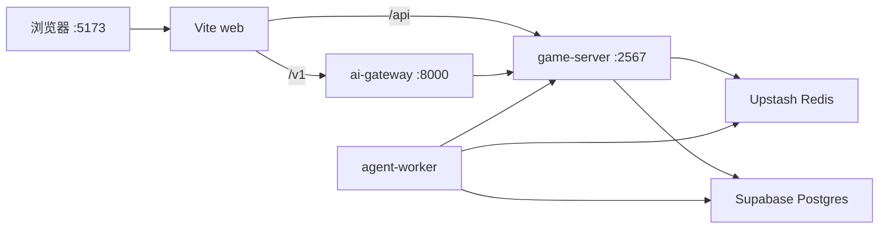

# AetherLife / 以太人生

AI 驱动的多人联机生活模拟 Web 游戏 — Phase 1 提供 monorepo、**Supabase + Upstash 云 dev 数据层**与 Core-4 action schema 基座。

## Prerequisites

- Node.js 20+
- pnpm 9+ (`corepack enable && corepack prepare pnpm@9.15.0 --activate`)
- [Supabase](https://supabase.com) 免费档 dev project（Postgres）
- [Upstash](https://upstash.com) 免费档 Redis
- Python 3.12+ and [uv](https://docs.astral.sh/uv/)（可选，本地跑 ai-gateway）
- Docker（**可选**，仅容器化 ai-gateway 时用 `pnpm docker:ai`）

Supabase 免费档项目闲置可能暂停；存储与连接数有上限，solo dev 通常够用。

## Setup

1. Clone the repository
2. `pnpm install`
3. **Supabase:** 新建项目 → Database → 复制 **Session pooler** URI → SQL Editor 执行 `CREATE EXTENSION IF NOT EXISTS vector;`
4. **Upstash:** 新建 Redis → 复制 TLS `REDIS_URL`
5. `cp .env.example .env` 并填入上述两个 URL（勿提交 `.env`）
6. `pnpm verify:cloud` — 确认 Postgres `SELECT 1` 与 Redis `PING` 成功
7. Phase 3+：`pnpm --filter @aetherlife/npc-memory db:migrate`（读仓库根目录 `.env` 里的 `DATABASE_URL`）
8. Phase 5+：`cd apps/ai-gateway && uv sync --extra dev`（首次安装 Python 依赖）

Phase 1 服务端仅通过 `DATABASE_URL` / `REDIS_URL` 连接云库；**不在浏览器使用 Supabase client**（Auth/RLS 留待后续 phase）。

## Local development（每次启动）

> **日常开发（Phase 5 完整链路）** — 仓库根目录、`.env` 已配好：
>
> ```bash
> pnpm dev:stack
> ```
>
> 浏览器打开 http://localhost:5173 。`Ctrl+C` 一次停掉全部本地进程。  
> **不需要** 本地起 Postgres / Redis（用 Supabase + Upstash 云实例）。

云上的 **Postgres（Supabase）** 和 **Redis（Upstash）** 不用本地起进程；本地只需跑下面 4 个逻辑角色（可用 **1 条命令** 或 **3 个终端**）。



| 角色 | 端口 | 做什么 |
|------|------|--------|
| web（Vite） | 5173 | 页面；`/v1` → gateway，`/api` → game-server |
| game-server | 2567 | 房间、SSE、记忆 API、audit、worker 回调 |
| ai-gateway | 8000 | NL 解析、输入审核、chat 入口、`check-reply` |
| agent-worker | — | 消费 Redis 队列，跑 NPC 回合 |

### 推荐：一条命令（单终端）

```bash
# 仓库根目录，.env 已配置
pnpm dev:stack
```

- 等价于同时跑：`pnpm dev` + `pnpm dev:ai` + `pnpm dev:worker`
- 浏览器：http://localhost:5173
- 按 `Ctrl+C` 会一起停掉（`-k`）

OpenRouter 限流或离线调试时，用 mock LLM：

```bash
pnpm dev:stack:mock
```

### 备选：分终端（看日志更清晰）

| 终端 | 命令 |
|------|------|
| 1 | `pnpm dev` |
| 2 | `pnpm dev:ai` |
| 3 | `pnpm dev:worker` |

### 按场景：最少要起什么

| 场景 | 启动 |
|------|------|
| **完整玩 Phase 5（默认）** | `pnpm dev:stack` 或上表 3 终端 |
| 只改前端 UI | `pnpm dev`（仅 web+gs；聊天需另起 ai+worker 才走 gateway） |
| 只改 game-server API | `pnpm dev` |
| 只改 gateway | `pnpm dev:ai` + 已有 gs/worker |
| 只跑自动化验收 | `pnpm dev:ai` + `pnpm dev` + `pnpm dev:worker`，然后 `pnpm verify:phase5` |
| gateway 用 Docker | `pnpm docker:ai` 替代 `dev:ai`（无热重载） |

### 首次 / 拉代码后（只做一次）

与「每次启动」分开：下面在 clone、换机、或依赖变更后跑，**不是每天必跑**。

```bash
pnpm install          # 含 concurrently，dev:stack 依赖它
pnpm verify:cloud
pnpm --filter @aetherlife/npc-memory db:migrate   # 有 DATABASE_URL 时
cd apps/ai-gateway && uv sync --extra dev         # Phase 5
```

### 每次开发（日常）

| 步骤 | 命令 |
|------|------|
| 1. 进仓库根目录 | `cd /path/to/AI-web` |
| 2. 启动全栈 | `pnpm dev:stack` |
| 3. 打开页面 | http://localhost:5173 |

可选：OpenRouter 429 / 离线 → `pnpm dev:stack:mock`（worker 用 mock LLM，gateway 仍起）。

### 端口与健康检查

```bash
curl -sf http://127.0.0.1:5173/        # web（Vite）
curl -sf http://127.0.0.1:2567/health  # game-server
curl -sf http://127.0.0.1:8000/health  # ai-gateway
```

若 `pnpm dev:ai` 报 `Address already in use`，先释放 8000：

```bash
kill $(lsof -t -iTCP:8000 -sTCP:LISTEN) 2>/dev/null
```

## Verify

```bash
pnpm turbo test
pnpm turbo build
pnpm verify:cloud
pnpm verify          # build + test + verify:cloud

# Phase 5 集成验收：先 pnpm dev:stack，再另开终端：
pnpm verify:phase5

curl -sf http://127.0.0.1:2567/health
curl -sf http://127.0.0.1:8000/health   # after dev:stack or pnpm dev:ai
```

Action contract details: [packages/game-actions/README.md](packages/game-actions/README.md)

## Phase 1 scope

Foundation only — no NPC AI, Colyseus multiplayer, or 2.5D rendering yet.

## Phase 2 — Single NPC text loop

Player free text → game-server enqueues `npc-turn` → Python `workers/agent-worker` → SSE reply + collapsible room state JSON in web UI.

### Dev workflow

见上文 **[Local development（每次启动）](#local-development每次启动)**。Phase 2 起需要 Redis + worker；Phase 5 起需要 ai-gateway。

### Phase 2 environment variables

| Variable | Purpose |
|----------|---------|
| `REDIS_URL` | Upstash Redis for BullMQ + worker bridge |
| `LLM_PROVIDER` | `openrouter` \| `groq` \| `agnes` (free-tier OpenAI-compatible) |
| `LLM_MODEL` | Provider model id (prefer `:free` suffix on OpenRouter) |
| `OPENROUTER_API_KEY` | OpenRouter API key |
| `GROQ_API_KEY` | Groq API key |
| `AGNES_API_KEY` | Agnes API key |
| `LLM_MOCK` | `1` for offline tests (no live LLM) |
| `DATABASE_URL` | Optional PostgresSaver checkpoints |
| `LANGCHAIN_*` | Optional LangSmith tracing |
| `INTERNAL_WORKER_TOKEN` | Optional Bearer token for `/internal/*` routes |
| `GAME_SERVER_URL` | Worker callback base (default `http://127.0.0.1:2567`) |

Free model examples (do **not** use Google/OpenAI official APIs):

- OpenRouter: `openrouter/free` (auto-picks available free models), `meta-llama/llama-3.2-3b-instruct:free`
- Groq: `llama-3.1-8b-instant`
- Agnes: `agnes-2.0-flash`

### Verify Phase 2

```bash
pnpm turbo build
pnpm turbo test
cd workers/agent-worker && LLM_MOCK=1 uv run pytest -q

# With game-server running on :2567
pnpm verify:phase2
```

Manual UAT: open http://localhost:5173 → send text → see thinking → NPC reply with collapsible state JSON →「新游戏」resets room.

## Phase 3 — Persistent memory (Postgres + pgvector)

Player chat writes memory **synchronously** (embed + importance + insert). Worker loads **bulk summary + reflection + top-k retrieved** into the LLM prompt; persists NPC turn memory; runs reflect every `REFLECT_EVERY_N` turns and bulk summarize when raw count ≥ `SUMMARIZE_THRESHOLD`.

### Setup

1. Complete embed spike: [docs/phase3-embed-spike.md](docs/phase3-embed-spike.md) (free OpenRouter model only — **no paid embed**)
2. Supabase SQL: `CREATE EXTENSION IF NOT EXISTS vector;`
3. `pnpm --filter @aetherlife/npc-memory db:migrate`
4. Set `DATABASE_URL` + `OPENROUTER_API_KEY` + `EMBED_*` in `.env`

### Reset vs checkpoint

`POST /rooms/:id/reset` deletes **Postgres memories and summaries** only. LangGraph **checkpoints are not cleared** (thread id `room:{roomId}:npc:1` may retain stale graph state until Phase 4+).

### Verify Phase 3

```bash
pnpm turbo build
pnpm turbo test
cd workers/agent-worker && LLM_MOCK=1 uv run pytest -q

# game-server running with DATABASE_URL (or LLM_MOCK=1 for mock embed)
pnpm verify:phase3
pnpm verify:phase3 -- --seed-bulk=100   # MEM-03 bulk smoke
```

Phase 3 env additions: `EMBED_MODEL`, `EMBED_BASE_URL`, `REFLECT_EVERY_N`, `SUMMARIZE_THRESHOLD`, `SUMMARIZE_BATCH_SIZE` — see `.env.example`.

## Phase 5 — NL gateway & safety

Web chat goes through **ai-gateway** (`POST /v1/rooms/:roomId/chat`); SSE stays on game-server (`/api/rooms/.../events`). Gateway runs NL parse in parallel with chat proxy, applies **ContentGuard** on input, and exposes `POST /v1/guard/check-reply` for game-server to sanitize NPC `done` events before clients see them.

日常开发：**`pnpm dev:stack`**（见 [Local development](#local-development每次启动)）。

`mutation_audit_logs` 表由 `pnpm --filter @aetherlife/npc-memory db:migrate` 创建（在根目录 `.env` 有 `DATABASE_URL` 时执行，勿依赖本机 `:5432`）。

### Verify Phase 5

```bash
cd apps/ai-gateway && uv sync --extra dev && uv run pytest tests -q
pnpm turbo test --filter=@aetherlife/game-server

# 先 dev:stack（或 3 终端等价），再：
pnpm verify:phase5
```

Env: `AI_GATEWAY_URL`, `GAME_SERVER_URL`, `INTERNAL_WORKER_TOKEN`（gateway → game-server）, optional `OPENAI_API_KEY`（Moderation）。
