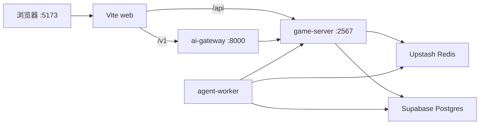

# 以太人生 / AetherLife

[](https://github.com/moyunzero/AetherLife/actions/workflows/ci.yml)
[](./LICENSE)

[English](./README.md) | **简体中文**

AI 驱动的多人联机生活模拟 Web 游戏：与拥有记忆的 NPC 用自然语言互动，在可扩展的程序化世界中移动、协作与叙事。Colyseus 权威同步，LangGraph worker 异步执行 NPC 回合，Postgres + pgvector 持久记忆。

## 目录

- [项目简介](#项目简介)
- [项目状态](#项目状态)
- [演示](#演示)
- [特性](#特性)
- [技术栈](#技术栈)
- [快速开始](#快速开始)
- [地图调试](#地图调试)
- [架构](#架构)
- [测试](#测试)
- [文档](#文档)
- [贡献](#贡献)
- [License](#license)

## 项目简介

玩家在星露谷式 2D 世界中探索、发现 LLM 注入的区块 lore，并通过对话与行为影响 NPC 对群体的集体态度。核心闭环——**感知 → 记忆 → 反思 → 执行**——须在每次会话中可验证；v4 起移除任务条 UI，改为 ambient 世界回响。

**目标用户：** 喜欢《模拟人生》《动物森友会》《我的世界》的玩家、AI 爱好者，以及偏社交与叙事驱动的玩家。

## 项目状态

| 里程碑 | Phases | 状态 | 交付日期 |
|--------|--------|------|----------|
| **v0** Phase 0 文本闭环 | 01–05 | ✅ 已交付 | 2026-06-04 |
| **v1** 图形 + 多人 + 世界 | 06–08, 10–12.1（09 暂缓） | ✅ 已交付 | 2026-06-07 |
| **v2** 可玩的 AI 小镇 | 12.2–15 | ✅ 已交付 | 2026-06-09 |
| **v3** 智能 Ambient + Speak SLA | 16–17.1, 18 | ✅ 已交付 | 2026-06-11 |
| **v4** 自主人生闭环 | 19–22 | ✅ 已交付 | 2026-06-22 |
| **v5** AI 议会 / 世界观 | 23–27 | 🔨 进行中 | Phase 23 ✅（2026-06-25） |
| **暂缓** 语音管线 | 09 | ⏸ 暂缓 | — |

Phase 24–27（世界编年史、议会辩论表决、12 NPC 上地图、个人人生时间线）规划中。

→ **[开发历程](./docs/DEVELOPMENT-HISTORY.zh-CN.md)** · [English](./docs/DEVELOPMENT-HISTORY.md)

## 演示

| | |
|---|---|
| **本地** | [http://localhost:5173](http://localhost:5173) — 运行 `pnpm dev:stack` |
| **截图** | _即将补充_ |
| **公网部署** | _暂无_ |

## 特性

- **多人联机** — Colyseus 权威同步，最多 4 人同房间
- **自然语言指挥** — ai-gateway 解析意图，worker 异步执行 NPC 回合
- **持久记忆** — Postgres + pgvector，NPC 记住互动并影响后续行为
- **Phaser 4 世界** — 网格移动、程序化 chunk 地形与世界 lore
- **智能 Ambient NPC（v3）** — schedule/zone 漫游、异步 LLM intent、Tiled 碰撞
- **Speak SLA（v3）** — worker-state / memory-context 缓存、stale fallback、多 Tab speak
- **集体态度** — NPC 对玩家/群体的态度随行为演化
- **议会人格（v5）** — 12 人 registry、`__council__` 记忆 scope（Phase 23）

## 技术栈

| 层 | 技术 |
|----|------|
| 客户端 | React 19 · Vite · Phaser 4 |
| 实时 | Colyseus · SSE |
| AI | LangGraph worker · FastAPI gateway |
| 数据 | Supabase Postgres · Upstash Redis |

Monorepo：`apps/web` · `apps/game-server` · `apps/ai-gateway` · `workers/agent-worker` · `packages/*`

## 快速开始

### 前置条件

- Node.js 20+、pnpm 9+（`corepack enable && corepack prepare pnpm@9.15.0 --activate`）
- [Supabase](https://supabase.com) 项目（Postgres + `CREATE EXTENSION vector`）
- [Upstash](https://upstash.com) Redis
- Python 3.12+、[uv](https://docs.astral.sh/uv/)（ai-gateway / worker）
- LLM API Key（见 `.env.example`；生产默认：**NVIDIA NIM** NPC 主路、**Groq** social JSON、OpenRouter embed）

### 安装与启动

```bash
git clone https://github.com/moyunzero/AetherLife.git
cd AetherLife
pnpm install
cp .env.example .env   # 填入 DATABASE_URL、REDIS_URL、LLM 密钥
pnpm verify:cloud
pnpm --filter @aetherlife/npc-memory db:migrate
cd apps/ai-gateway && uv sync --extra dev && cd ../..
pnpm dev:stack
```

浏览器打开 **http://localhost:5173**。`Ctrl+C` 停止全部本地进程。

> 无需本地 Postgres/Redis — 开发默认使用 Supabase + Upstash 云实例。  
> UI 冒烟可用 `pnpm dev:stack:mock`；**phase 验收脚本须真实 LLM**（`pnpm dev:stack`，禁止 `LLM_MOCK=1`）。

### 健康检查

```bash
curl -sf http://127.0.0.1:5173/
curl -sf http://127.0.0.1:2567/health
curl -sf http://127.0.0.1:8000/health
```

## 地图调试

调试地图、出生点或碰撞时，需要知道**每一格的游戏坐标 `(gx, gy)`**。坐标系约定：**1 个 Tiled 瓦片 = 1 个游戏格**（32px/格）；Beginning Fields 家园区为 **40×40** 格。详见 [docs/BEGINNING-FIELDS.md](./docs/BEGINNING-FIELDS.md)。

### 日常：当前所在格

启动 `pnpm dev:stack` 并进房后，画布上方的坐标条会随玩家移动实时显示：

- **格 `(gx, gy)`** — 全局网格坐标（与 Tiled / `spawns.json` / 服务端 walkability 一致）
- **chunk `(cx, cy)`** — 程序化区块坐标
- **biome / 区域名** — 当前格地形与 WorldRegion 标签

### 网格叠加：`?gridDebug=1`（推荐）

在 URL 加上查询参数，例如：

```text
http://localhost:5173/?gridDebug=1
```

进房后会出现：

| 功能 | 说明 |
|------|------|
| **网格线** | 覆盖 Beginning Fields 全图 40×40 格 |
| **鼠标悬停** | 顶部 HUD 显示 `格 (x, y)` 及 **可走 / 阻挡 / 区外**；格子高亮（绿=可走，红=阻挡，黄=区外） |
| **议会出生点** | 绿色方框标出 12 个 `councilSpawns` 锚点 |
| **Shift + 点击** | 记录候选出生点（最多 12 个），控制台输出完整列表 |

浏览器控制台可用：

```js
window.__aetherlife_gridPicks          // 已选坐标数组
window.__aetherlife_clearGridPicks()  // 清空
window.__aetherlife_spawnCellInfo(9, 21)  // 查询某格是否可走
```

改 `apps/game-server/data/world/beginning-fields@v1/spawns.json` 或 Tiled 碰撞层后，用此模式核对坐标再跑 `node scripts/bake-beginning-fields.mjs`。

### 区块边界：`?terrainDebug=1`

程序化 chunk 地形调试（家园 Tiled 区外）：

```text
http://localhost:5173/?terrainDebug=1
```

会在已加载 chunk 外围绘制边界框，便于核对 `(cx, cy)` 与 `(gx, gy)` 的对应关系。可与 `gridDebug` 同时使用：`?gridDebug=1&terrainDebug=1`。

### 常用参考坐标

| 用途 | 坐标 `(gx, gy)` |
|------|-----------------|
| 默认玩家出生 | `(34, 13)` |
| 家园地图范围 | `x, y ∈ [0, 39]` |
| 议会 12 席锚点 | 见 [BEGINNING-FIELDS.md §议会出生点](./docs/BEGINNING-FIELDS.md#议会-12-席出生点phase-26--村内多点分散) |

## 架构



| 服务 | 端口 | 职责 |
|------|------|------|
| web | 5173 | UI；代理 `/v1` → gateway、`/api` → game-server |
| game-server | 2567 | Colyseus 房间、SSE、记忆 API |
| ai-gateway | 8000 | NL 解析、输入审核、chat 入口 |
| agent-worker | — | Redis 队列消费，NPC LangGraph 回合 |

分终端调试：`pnpm dev` · `pnpm dev:ai` · `pnpm dev:worker`（等价于 `pnpm dev:stack`）。

## 测试

```bash
pnpm turbo test
pnpm turbo build
pnpm verify          # build + test + verify:cloud
pnpm agent:verify    # diff → mapped unit tests (mock LLM OK)

# 跨层单测（可 mock LLM）
pnpm --filter @aetherlife/game-server test
cd workers/agent-worker && LLM_MOCK=1 uv run pytest -q
cd apps/ai-gateway && uv run pytest tests -q
```

Phase 集成验收（需 `pnpm dev:stack` + 真实 API Key）：见 [CONTRIBUTING.md](./CONTRIBUTING.md#集成验收)。  
Golden Flows：`pnpm agent:verify --e2e --base`（[docs/E2E-POLICY.md](./docs/E2E-POLICY.md)）。

Action schema：[packages/game-actions/README.md](./packages/game-actions/README.md)

## 文档

| 文档 | 说明 |
|------|------|
| **[开发历程](./docs/DEVELOPMENT-HISTORY.zh-CN.md)** | 全部 37 Phase：时间线、思路、状态、验收命令 |
| [CONTRIBUTING.md](./CONTRIBUTING.md) | 协作流程、约束与验收命令 |
| [docs/CONTRACTS.md](./docs/CONTRACTS.md) | game-server ↔ worker API 契约 |
| [docs/INVARIANTS-MULTIPLAYER.md](./docs/INVARIANTS-MULTIPLAYER.md) | 多人空间与 NL 不变量 |
| [docs/MOVEMENT-ARCHITECTURE.md](./docs/MOVEMENT-ARCHITECTURE.md) | Phaser 移动与 Colyseus 同步 |
| [docs/E2E-POLICY.md](./docs/E2E-POLICY.md) | E2E / UAT 策略与 Golden Flows |
| [docs/PHASE-EVOLUTION.md](./docs/PHASE-EVOLUTION.md) | 阶段演进与跨层防债务 |
| [docs/COUNCIL-PERSONAS.md](./docs/COUNCIL-PERSONAS.md) | 十二议会人设 SSOT + 导出/审计 |

## 贡献

欢迎 Issue 与 PR。请先阅读 [CONTRIBUTING.md](./CONTRIBUTING.md)。请勿提交 `.env` 或 API 密钥。

## License

[MIT](./LICENSE)
