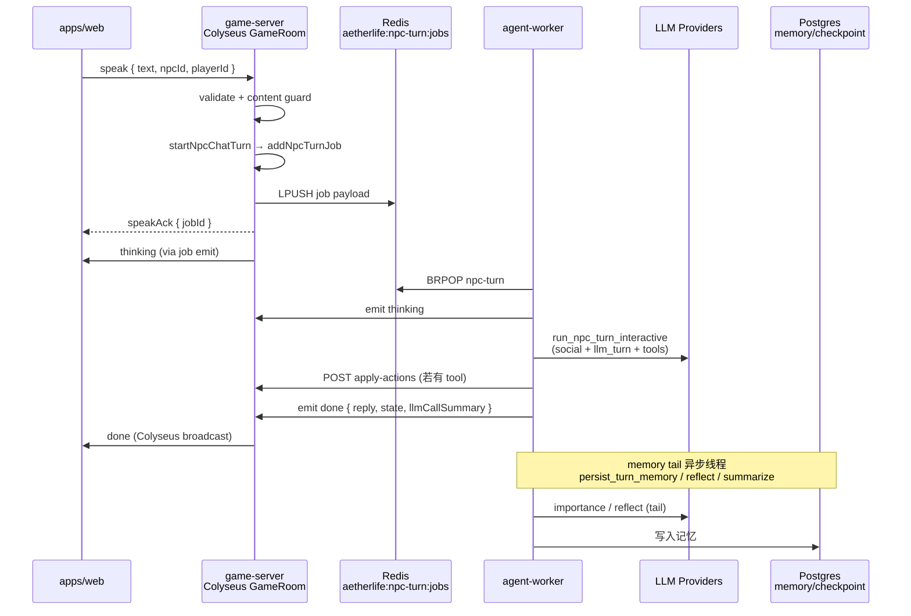

# LLM 端到端流程与延迟报告

> 生成时间：2026-06-09  
> 方法：Codegraph 架构梳理 + 真实 LLM E2E（`pnpm dev:stack`，**无** `LLM_MOCK`）  
> 相关：[LLM-ROUTING.md](./LLM-ROUTING.md) · [E2E-POLICY.md](./E2E-POLICY.md) · [LLM-MODEL-VERIFY.md](./LLM-MODEL-VERIFY.md)

---

## 1. 项目端到端流程（Speak / NPC 对话）

### 1.1 架构总览



### 1.2 分层职责

| 层 | 路径 | 职责 |
|----|------|------|
| **Web 客户端** | `apps/web` | Phaser 场景 + `useNpcChat`；发 `speak`、收 `thinking` / `done` / `speakBusy` |
| **Colyseus** | `apps/game-server/src/colyseus/GameRoom.ts` | `onMessage("speak")` → 校验 → `startNpcChatTurn` → `registerJob` → `speakAck` |
| **队列** | `apps/game-server/src/queue/npc-turn.ts` | BullMQ + Redis bridge `aetherlife:npc-turn:jobs`（LPUSH/BRPOP FIFO） |
| **Worker 主循环** | `workers/agent-worker/src/main.py` | `process_job`：thinking → `run_npc_turn_interactive` → done → **异步** `run_npc_memory_tail` |
| **LangGraph** | `workers/agent-worker/src/graph/npc_loop.py` | `llm_turn`（主对话 + tool calling）→ `apply_tools` → 社交感知 JSON |
| **Gateway 旁路** | `apps/ai-gateway` | HTTP `/v1/rooms/:id/chat` 同样入队；SSE `/rooms/:id/events?jobId=` 收事件 |
| **记忆** | worker tail + game-server embed | `persist_turn_memory` + Agnes reflect + OpenRouter embed → pgvector |

### 1.3 关键代码锚点（Codegraph）

| 步骤 | 符号 | 文件 |
|------|------|------|
| 客户端 speak | `COLYSEUS_CLIENT_MESSAGES.speak` | `packages/shared/src/colyseus.ts` |
| 服务端事件 | `thinking` / `done` / `llmCallSummary` | 同上 + worker `emit_job_event` |
| 入队 | `startNpcChatTurn` → `addNpcTurnJob` | `npc-chat.ts` / `npc-turn.ts` |
| Worker 处理 | `process_job` | `workers/agent-worker/src/main.py:104` |
| LLM 主回合 | `llm_turn` → `_invoke_llm_turn` | `npc_loop.py:277` |
| 世界变更 | `apply_tools` → `apply-actions` | `npc_loop.py:366` |
| 记忆尾 | `run_npc_memory_tail` → `persist_turn_memory` | `npc_loop.py:719` |

### 1.4 LLM 调用角色（当前 `.env` 默认）

| 角色 | Provider / 模型 | 触发时机 | 是否阻塞 `done` |
|------|-----------------|----------|-----------------|
| **NPC 主对话** (tool calling) | NVIDIA `openai/gpt-oss-120b`（OpenRouter fallback 见 ROUTING） | 每 speak 回合 | **是** |
| **Social JSON** | NVIDIA `qwen/qwen3.5-397b-a17b` | 每 speak 回合（图内节点） | **是** |
| **Memory importance** | NVIDIA nano | memory tail | 否（异步） |
| **Reflect / Lore** | Agnes | tail / 踏入新 chunk | 否 / 异步 |
| **Embed** | OpenRouter Nemotron | 记忆写入 | 否 |
| **Gateway NL parse** | OpenRouter | 仅 gateway 路径 | 视路径 |

设计约束（[AGENTS.md](../AGENTS.md)）：**禁止**在 Colyseus `onMessage` 内同步调 LLM；智谱 glm-4.7-flash 账户并发=1，speak 路径不得并行打 importance。

---

## 2. E2E 自动化测试执行记录

**环境：** `pnpm dev:stack`（Config B：NVIDIA primary + social）；macOS；2026-06-09。

| 命令 | 结果 | 说明 |
|------|------|------|
| `node scripts/benchmark-llm-e2e-latency.mjs` | **PASS** | 新建脚本，测 gateway + Colyseus 三条 speak 延迟 |
| `pnpm verify:llm-models` | **9/12 PASS** | 各 provider 探针延迟，见 §3.1 |
| `pnpm verify:phase6` | **PASS** | 双客户端移动 + speak thinking→done（~21s 总耗时） |
| `pnpm verify:phase5` | **SKIP** | 脚本未加载 `.env`，缺 `OPENROUTER_API_KEY` 等 env 检查失败（phase6 已内联 load env） |

**复现命令：**

```bash
pkill -f "LLM_MOCK=1.*src.main" || true
pnpm dev:stack   # 终端 1

# 终端 2
node scripts/benchmark-llm-e2e-latency.mjs
pnpm verify:llm-models
pnpm verify:phase6
pnpm verify:phase8   # 多人 NL（可选，耗时长）
```

E2E 策略：[E2E-POLICY.md](./E2E-POLICY.md) — **禁止** `LLM_MOCK=1`；默认 speak 超时 `E2E_SPEAK_TIMEOUT_MS=180000`。

---

## 3. LLM 延迟测量

### 3.1 Provider 探针（`pnpm verify:llm-models`）

Run 2026-06-09T04:58:46Z，完整表格见 [LLM-MODEL-VERIFY.md § Run history](./LLM-MODEL-VERIFY.md)。

| 角色 | Provider / 模型 | 延迟 | 结果 |
|------|-----------------|------|------|
| NPC 主对话 (primary) | siliconflow / `Qwen/Qwen3.5-4B` | **>90s timeout** | **FAIL** |
| Memory reflect | agnes / `agnes-2.0-flash` | 1327 ms | PASS |
| Lore T1 / T0 | agnes | 1062 / 621 ms | PASS |
| Lore fallback | nvidia super-49b | 1807 ms | PASS |
| Memory importance | nvidia nano-8b | 1143 ms | PASS |
| **NPC social JSON** | nvidia `qwen/qwen3.5-397b-a17b` | **2461 ms** | PASS |
| NVIDIA fast (catalog) | 同上 | 1887 ms | PASS |
| OpenRouter NPC fallback | `openai/gpt-oss-120b:free` | 1621 ms | PASS |
| Memory embed | OpenRouter Nemotron | 931 ms | PASS |
| Cerebras gpt-oss-120b | cerebras | 403 HTML | FAIL |
| NVIDIA agent glm-5.1 | nvidia | **>180s timeout** | FAIL |

**结论（SiliconFlow 时代，2026-06-09 早）：** social 路径 ~2s 稳定；SiliconFlow 主 NPC 探针 **90s 超时** — 端到端主要风险源。

**Config B 验证（2026-06-09 午）：** `LLM_PROVIDER=nvidia` + `LLM_MODEL_NPC=openai/gpt-oss-120b` — NPC 探针 **1940 ms PASS**；worker 启动日志 `provider=nvidia model=openai/gpt-oss-120b`。

### 3.2 端到端 Speak 延迟（`benchmark-llm-e2e-latency.mjs`）

测量分段：

- **speak→thinking**：从发 speak（或 POST chat）到首个 `thinking` 事件
- **thinking→done**：LLM 推理 + tool + apply-actions + guard
- **total E2E**：到 `done` 为止

| 路径 | 消息 | speakAck/POST | speak→thinking | thinking→done | **Total** | llmCallSummary |
|------|------|---------------|----------------|---------------|-----------|----------------|
| gateway-chat | 你好，用一句话介绍你自己。 | POST 8230 ms | 1 ms | 14346 ms | **14347 ms** | social/nvidia/397B ×1 |
| colyseus-speak | hello from latency benchmark | speakAck 3834 ms | 4163 ms | 10543 ms | **14706 ms** | social/nvidia/397B ×1 |
| colyseus-speak | 请向右走一步。 | speakAck 4319 ms | 4611 ms | 20312 ms | **24923 ms** | social/nvidia/397B ×1 |

#### Config B E2E（NVIDIA `openai/gpt-oss-120b` primary，2026-06-09T05:16Z）

| 路径 | 消息 | speakAck/POST | speak→thinking | thinking→done | **Total** |
|------|------|---------------|----------------|---------------|-----------|
| gateway-chat | 你好，用一句话介绍你自己。 | POST 5907 ms | 0 ms | 10944 ms | **10944 ms** |
| colyseus-speak | hello from latency benchmark | speakAck 3299 ms | 3365 ms | 17589 ms | **20954 ms** |
| colyseus-speak | 请向右走一步。 | speakAck 3966 ms | 4671 ms | 24071 ms | **28742 ms** |

对比 SiliconFlow 配置：gateway **14.3s → 10.9s**（−24%）；含移动 speak **24.9s → 28.7s**（略慢，social+tool 路径波动）。主路径不再 90s 超时挂死。

Worker 日志摘录（SiliconFlow 配置）：

- 前两条：`social skipped … kind=ignore`（社交 JSON 判定为 ignore，仍计入 llmCallSummary）
- 第三条：`social applied … kind=help`（集体分更新 `collectiveUpdated=True`）

**观察：**

1. **玩家可感知延迟 ~15–25s**，高于 AGENTS 目标「AI 决策 1–3s」；主因是 SiliconFlow primary 超时/慢 fallback + 多节点串行（social + main + guard）。
2. **gateway POST ~8s** 才返回 `jobId` — 含 NL parse / 入队 / 同步路径开销，需单独 profiling。
3. **`llmCallSummary` 仅列出 social 角色** — interactive recorder 当前未暴露 main `llm_turn` 条目；tail 记忆 LLM 在 `done` 之后异步执行（设计如此）。
4. **含 NL 动作**（「请向右走一步」）total **~25s**，比纯寒暄 ~15s 慢 ~67%。

### 3.3 Phase 6 E2E

`pnpm verify:phase6` 全链路（双客户端移动 + speak）在 **~21s** 内完成，与 benchmark 同量级。

### 3.4 与产品 SLA 对照

| 指标 | 目标（CLAUDE/AGENTS） | 本次实测 | 判定 |
|------|----------------------|----------|------|
| 位置同步 | <200 ms | move 步进 <5s（verify:phase6） | OK |
| AI 决策可感知 | 1–3 s + thinking UI | **15–25 s** 至 done | **超标** |
| Speak 超时上限 | 180 s | 未触发 | OK |

---

## 4. 风险与建议

| 优先级 | 问题 | 建议 |
|--------|------|------|
| P0 | ~~SiliconFlow primary 90s 超时~~ | **已切 Config B**（NVIDIA gpt-oss-120b）；SiliconFlow 仅作备用/国内候选 |
| P1 | E2E 10–29s 仍高于 1–3s 目标 | 保持 thinking UI；考虑 social/main 并行；监控 NIM RPM |
| P2 | `verify:phase5` 不 load `.env` | 与 phase6 对齐，脚本开头读 `.env` |
| P2 | `llmCallSummary` 缺 main 角色 | worker `record_llm_call("main", …)` 纳入 done payload，便于监控 |
| P3 | Cerebras / glm-5.1 agent 探测失败 | 预期：Cerebras 5 RPM；glm-5.1 仅 async agent，勿上 speak 热路径 |

---

## 5. 附录：benchmark 脚本

`scripts/benchmark-llm-e2e-latency.mjs` — 输出人类可读分段 + JSON summary（可 pipe 到 CI artifact）。

```bash
pnpm dev:stack
node scripts/benchmark-llm-e2e-latency.mjs | tee .planning/e2e-full-run/llm-latency-$(date +%Y%m%d).json
```

JSON 字段：`postMs` / `speakAckMs` / `firstThinkingMs` / `llmDoneMs` / `totalMs` / `llmCallSummary`。
