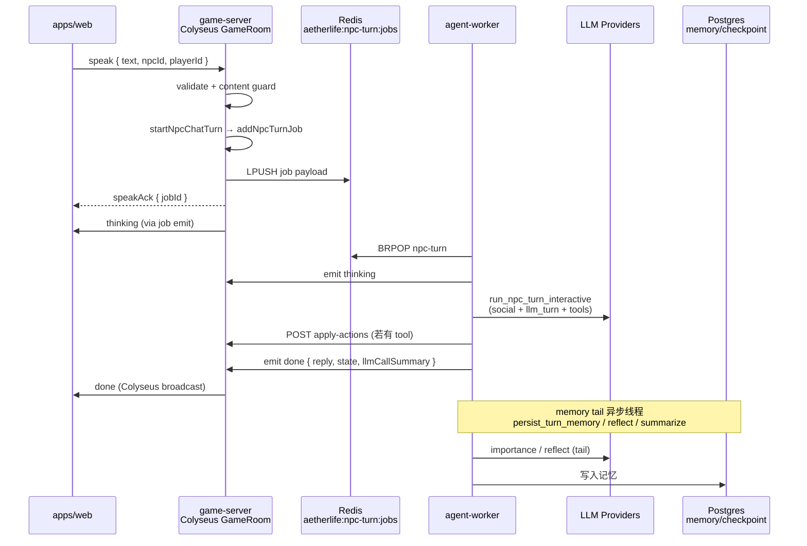

# LLM 端到端流程与延迟报告

> 生成时间：2026-06-09  
> 方法：Codegraph 架构梳理 + 真实 LLM E2E（`pnpm dev:stack`，**无** `LLM_MOCK`）  
> 相关：[LLM-ROUTING.md](./LLM-ROUTING.md) · [E2E-POLICY.md](./E2E-POLICY.md) · [LLM-MODEL-VERIFY.md](./LLM-MODEL-VERIFY.md)

---

## 1. 项目端到端流程（Speak / NPC 对话）

### 1.1 架构总览



### 1.2 分层职责

| 层 | 路径 | 职责 |
|----|------|------|
| **Web 客户端** | `apps/web` | Phaser 场景 + `useNpcChat`；发 `speak`、收 `thinking` / `done` / `speakBusy` |
| **Colyseus** | `apps/game-server/src/colyseus/GameRoom.ts` | `onMessage("speak")` → 校验 → `startNpcChatTurn` → `registerJob` → `speakAck` |
| **队列** | `apps/game-server/src/queue/npc-turn.ts` | BullMQ + Redis bridge `aetherlife:npc-turn:jobs`（LPUSH/BRPOP FIFO） |
| **Worker 主循环** | `workers/agent-worker/src/main.py` | `process_job`：thinking → `run_npc_turn_interactive` → done → **异步** `run_npc_memory_tail` |
| **LangGraph** | `workers/agent-worker/src/graph/npc_loop.py` | `llm_turn`（主对话 + tool calling）→ `apply_tools` → 社交感知 JSON |
| **Gateway 旁路** | `apps/ai-gateway` | HTTP `/v1/rooms/:id/chat` 同样入队；SSE `/rooms/:id/events?jobId=` 收事件 |
| **记忆** | worker tail + game-server embed | `persist_turn_memory` + Agnes reflect + OpenRouter embed → pgvector |

### 1.3 关键代码锚点（Codegraph）

| 步骤 | 符号 | 文件 |
|------|------|------|
| 客户端 speak | `COLYSEUS_CLIENT_MESSAGES.speak` | `packages/shared/src/colyseus.ts` |
| 服务端事件 | `thinking` / `done` / `llmCallSummary` | 同上 + worker `emit_job_event` |
| 入队 | `startNpcChatTurn` → `addNpcTurnJob` | `npc-chat.ts` / `npc-turn.ts` |
| Worker 处理 | `process_job` | `workers/agent-worker/src/main.py:104` |
| LLM 主回合 | `llm_turn` → `_invoke_llm_turn` | `npc_loop.py:277` |
| 世界变更 | `apply_tools` → `apply-actions` | `npc_loop.py:366` |
| 记忆尾 | `run_npc_memory_tail` → `persist_turn_memory` | `npc_loop.py:719` |

### 1.4 LLM 调用角色（当前 `.env` 默认）

| 角色 | Provider / 模型 | 触发时机 | 是否阻塞 `done` |
|------|-----------------|----------|-----------------|
| **NPC 主对话** (tool calling) | NVIDIA `openai/gpt-oss-120b`（OpenRouter fallback 见 ROUTING） | 每 speak 回合 | **是** |
| **Social JSON** | NVIDIA `meta/llama-3.3-70b-instruct`（fallback Agnes） | 每 speak 回合（图内节点） | **是** |
| **Memory importance** | NVIDIA nano | memory tail | 否（异步） |
| **Reflect / Lore** | Agnes | tail / 踏入新 chunk | 否 / 异步 |
| **Embed** | OpenRouter Nemotron | 记忆写入 | 否 |
| **Gateway NL parse** | OpenRouter | 仅 gateway 路径 | 视路径 |

设计约束（[AGENTS.md](../AGENTS.md)）：**禁止**在 Colyseus `onMessage` 内同步调 LLM；智谱 glm-4.7-flash 账户并发=1，speak 路径不得并行打 importance。

---

## 2. E2E 自动化测试执行记录

**环境：** `pnpm dev:stack`（Config B：NVIDIA primary + social）；macOS；2026-06-09。

| 命令 | 结果 | 说明 |
|------|------|------|
| `node scripts/benchmark-llm-e2e-latency.mjs` | **PASS** | 新建脚本，测 gateway + Colyseus 三条 speak 延迟 |
| `pnpm verify:llm-models` | **9/12 PASS** | 各 provider 探针延迟，见 §3.1 |
| `pnpm verify:phase6` | **PASS** | 双客户端移动 + speak thinking→done（~21s 总耗时） |
| `pnpm verify:phase5` | **SKIP** | 脚本未加载 `.env`，缺 `OPENROUTER_API_KEY` 等 env 检查失败（phase6 已内联 load env） |

**复现命令：**

```bash
pkill -f "LLM_MOCK=1.*src.main" || true
pnpm dev:stack   # 终端 1

# 终端 2
node scripts/benchmark-llm-e2e-latency.mjs
pnpm verify:llm-models
pnpm verify:phase6
pnpm verify:phase8   # 多人 NL（可选，耗时长）
```

E2E 策略：[E2E-POLICY.md](./E2E-POLICY.md) — **禁止** `LLM_MOCK=1`；默认 speak 超时 `E2E_SPEAK_TIMEOUT_MS=180000`。

---

## 3. LLM 延迟测量

### 3.1 Provider 探针（`pnpm verify:llm-models`）

`pong` 探针 **不能**代表 social JSON 延迟；social 须用 `scripts/benchmark-social-providers.py`（生产 `SOCIAL_SYSTEM_PROMPT` + 叙事问句）。

**Social JSON 实测（2026-06-15，`benchmark-social-providers.py`，25s timeout）：**

| 模型 | 延迟 | JSON | 备注 |
|------|------|------|------|
| `meta/llama-3.3-70b-instruct` | **894 ms** | ✅ | **当前 `LLM_MODEL_SOCIAL` 默认** |
| `mistralai/mistral-nemotron` | 1737 ms | ✅ | 备选 |
| `agnes-2.0-flash` | 5772 ms | ✅ | `LLM_PROVIDER_SOCIAL_FALLBACK` |
| `qwen/qwen3.5-397b-a17b` | 超时 | ❌ | 旧默认；`pong` ~2s 但 social JSON 不可靠 |

Run 2026-06-09T04:58:46Z **`pong` 探针**（完整表格见 [LLM-MODEL-VERIFY.md § Run history](./LLM-MODEL-VERIFY.md)）：

| 角色 | Provider / 模型 | 延迟 | 结果 |
|------|-----------------|------|------|
| NPC 主对话 (primary) | siliconflow / `Qwen/Qwen3.5-4B` | **>90s timeout** | **FAIL** |
| Memory reflect | agnes / `agnes-2.0-flash` | 1327 ms | PASS |
| Lore T1 / T0 | agnes | 1062 / 621 ms | PASS |
| Lore fallback | nvidia super-49b | 1807 ms | PASS |
| Memory importance | nvidia nano-8b | 1143 ms | PASS |
| **NPC social JSON** | nvidia `qwen/qwen3.5-397b-a17b` | **2461 ms** (`pong`) | PASS — **已弃用**（social JSON 25s 超时，见上表） |
| NVIDIA fast (catalog) | 同上 | 1887 ms | PASS |
| OpenRouter NPC fallback | `openai/gpt-oss-120b:free` | 1621 ms | PASS |
| Memory embed | OpenRouter Nemotron | 931 ms | PASS |
| Cerebras gpt-oss-120b | cerebras | 403 HTML | FAIL |
| NVIDIA agent glm-5.1 | nvidia | **>180s timeout** | FAIL |

**结论（SiliconFlow 时代，2026-06-09 早）：** social 路径 ~2s 稳定；SiliconFlow 主 NPC 探针 **90s 超时** — 端到端主要风险源。

**Config B 验证（2026-06-09 午）：** `LLM_PROVIDER=nvidia` + `LLM_MODEL_NPC=openai/gpt-oss-120b` — NPC 探针 **1940 ms PASS**；worker 启动日志 `provider=nvidia model=openai/gpt-oss-120b`。

### 3.2 口径说明：SDK-only vs 浏览器全路径

| 脚本 | 测什么 | 不含什么 |
|------|--------|----------|
| `scripts/benchmark-llm-e2e-latency.mjs` | Colyseus SDK 直连 `speak` + gateway POST | **无** Playwright、**无** `nl/parse`、**无** React composer / MessageList、**无** Phaser tween |
| `scripts/benchmark-speak-browser.mjs` | 真实 Web UI（`?phaserFallback=1&speakLatencyTrace=1`） | 含 `nl/parse` 网络、`thinking` 气泡、`done` 后 composer idle、移动用例 sprite 权威格 |

§3.2 下表为 **SDK-only**；玩家体感须看 §3.2.1。**P0 提速后** `nl/parse` 与 `speak` 并行，浏览器分段里 `nl_parse_network` 通常 **<5 ms**（不再阻塞发送）。

### 3.2.1 浏览器全路径 Speak（`benchmark-speak-browser.mjs`）

**环境：** `pnpm dev:stack`（禁止 `LLM_MOCK`）；`BENCHMARK_ROUNDS` 默认 15（warmup 首轮不计入统计）。

```bash
pkill -f "LLM_MOCK=1.*src.main" || true
pnpm dev:stack
node scripts/benchmark-speak-browser.mjs   # 或 pnpm benchmark:speak-browser
node scripts/benchmark-llm-e2e-latency.mjs # 同会话 SDK 对照
```

**分段 KPI：** `t0` 点击发送 → `nl_parse` response → `speakAck` → `.message--thinking` visible → **首 `speak_partial` mark（TTFT）** / `[data-testid=npc-streaming-reply]` → `.message--npc` 有字 → composer 非 `aria-busy` →（移动用例）Phaser `npcGrid` 到达权威格。

**Slice 0–4 提速后目标（`BENCHMARK_ROUNDS=15`）：**

| 用例 | done p50 | TTFT（`speak_partial`） |
|------|----------|-------------------------|
| B1 闲聊 | ≤5s | ≤2s |
| B3 快路径 | ≤5s | N/A（零 social LLM） |
| B2 物理 | 8–12s | 可选 stub 首句 partial |

JSON 报告字段：`segmentsMs.ttft_partial`、`speakIntent`、`phaseTimingMs`（来自 job `done`；含 `t_fetch_state_ms`、`t_memory_ms`、`t_lazy_lore_ms`、`t_worker_state_stale_ms`；fast lane 含 `t_fast_lane_ms`、`t_compose_ms`）。

**Phase 17 pre-LLM 目标：** `t_fetch_state_ms` + `t_memory_ms` p95 **<2s**（hard 3s）；`skipNearbyLore=1` 默认；worker-state stale fallback 时 `room_snapshot._stale=true`。

**B1 CASUAL Fast Lane（P3）：** `can_use_casual_fast_lane` 命中时 `process_job` 在 graph 前 `speakPartial`（`preview_casual_stub`），再 `run_casual_fast_lane`：`fetch_state?skipNearbyLore=1` → `apply_social_event` → `compose_reply`；**无** Postgres checkpoint / 6 节点 LangGraph / memory HTTP。RECALL/NARRATIVE/PHYSICAL 及 non-deterministic CASUAL 仍走 `run_npc_turn_interactive`。

**B1 TTFT（P4，≤2s 目标）：** CASUAL deterministic stub 在 **三处** 同步：`packages/shared` `previewCasualSpeakStub`（`stableStringHash` + 与 Python 相同模板池）→ (1) Web `dispatchSpeak` **client_mirror**（`setStreamingReply` + `recordSpeakLatencyMark("speak_partial", { source: "client_mirror" })`，在 `room.send` 前）；(2) `GameRoom` / SSE `chat.ts` **speakAck 后立即** `emitJobEvent(speakPartial)`（enqueue 前）；(3) worker fast lane 若 payload `casualPreviewEmitted` 则 **跳过** 重复 `partial_emit`。Benchmark TTFT = 首次 `speak_partial` mark（通常 client_mirror **~0–1 ms**）。RECALL 等 intent **禁止** 早发（共享 `classifySpeakIntent` 与 worker 对齐）。

**Run 2026-06-11 — Slice 0–4 验收**（Config B：`LLM_PROVIDER=nvidia`，`BENCHMARK_ROUNDS=15`，skip warmup；JSON：`.planning/benchmarks/speak-browser-1781148871581.json`）：

| 用例 | 消息 | total p50 | total p95 | ttft p50 | speakIntent |
|------|------|-----------|-----------|----------|-------------|
| B1 闲聊 | 你好，用一句话简短回复 | **11424 ms** | 13941 ms | 8212 ms | casual |
| B2 物理 | 请向右走一步 | **15450 ms** | 26091 ms | 4546 ms | physical |
| B3 快路径 | 去费雪旁边 | **6902 ms** | 11955 ms | 3142 ms | physical |

对照 § 目标：B3 total **达标**（≤5s）；B1/B2 仍受 social/tool LLM 延迟与 NVIDIA 路由波动影响；`speakPartial` TTFT 已可观测但 B1 首字 **~8s**（JSON reply 流式解析 + 上游 TTFT）。

**Run 2026-06-11 — P3 Fast Lane**（`LLM_PROVIDER=nvidia`，`BENCHMARK_ROUNDS=15`，含 warmup；B1 15 轮完整，全量脚本在 B2 r15 超时中断）：

| 用例 | 消息 | total p50 | total p95 | ttft p50 | speakIntent |
|------|------|-----------|-----------|----------|-------------|
| B1 闲聊 | 你好，用一句话简短回复 | **3377 ms** | 6958 ms | **3251 ms** | casual |

对照 § 目标：B1 total **达标**（p50 ≤5s，较 Slice 0–4 **11.4s** 降 ~70%）；TTFT p50 **3.3s** 仍高于 ≤2s（`speakAck`→worker BRPOP→early `speakPartial` 占主导；方案 C / job 调度为 follow-up）。修复 fast-lane `done` 竞态：`GameRoom` speakAck 先于 enqueue + `useNpcChat` onDone adopt `jobId`（Guardrail #70）。

**Run 2026-06-11 — P4 TTFT（client_mirror + game-server stub）**（`LLM_PROVIDER=nvidia`，`BENCHMARK_ROUNDS=15`，`pnpm dev:stack` 真实 LLM）：

| 用例 | 消息 | total p50 | ttft p50 | speakIntent |
|------|------|-----------|----------|-------------|
| B1 闲聊 | 你好，用一句话简短回复 | **4521 ms** | **1 ms** | casual |

JSON：`.planning/benchmarks/speak-browser-1781155186602.json`

对照 § 目标：B1 TTFT **达标**（p50 ≤2s）；首字由 Web `client_mirror` 在 dispatch 打 mark，不再依赖 Redis BRPOP + worker HTTP。B1 total p50 **4521 ms**（达标 ≤5s）；p95 **9476 ms** 仍受 fast lane `done` 与 LLM 路由波动影响。

**Run 2026-06-10 — P0/P1 基线**（`BENCHMARK_ROUNDS=5`，无 `speakPartial` / `speakIntent`）：

| 用例 | 消息 | total p50 | total p95 | bubble p50 | nl_parse p50 |
|------|------|-----------|-----------|------------|--------------|
| B1 闲聊 | 你好，用一句话简短回复 | **12036 ms** | 14546 ms | 12019 ms | 1 ms |
| B2 物理 | 请向右走一步 | **20603 ms** | 26593 ms | 20601 ms | 0 ms |
| B3 快路径 | 去费雪旁边 | **10493 ms** | 23681 ms | 10476 ms | 0 ms |

**同会话 SDK 对照（单次）：**

| 路径 | 消息 | total | speakAck |
|------|------|-------|----------|
| gateway-chat | 你好… | 9599 ms | POST 4096 ms |
| colyseus-speak | hello benchmark | 12724 ms | 2501 ms |
| colyseus-speak | 请向右走一步 | 18076 ms | 2698 ms |

**观察：**

1. P0（`speak` 先发送、`nl/parse` 后台）后，浏览器 **total ≈ bubble**；旧体感「多等 2s parse」已消除。
2. Slice 0–4：B3 p50 **6.9s**（较 2026-06-10 **10.5s** 改善）；B2 p50 **15.5s**（较 **20.6s** 改善）；B1 Slice 0–4 基本持平（CASUAL 仍走 LangGraph + memory 并行）。**P3 Fast Lane**：B1 total p50 **3.4s**（达标）；TTFT p50 **3.3s**（未达 ≤2s，queue/worker 启动为主因）。
3. `speakIntent` 分桶与 `phaseTimingMs` 已写入 benchmark JSON；TTFT 来自 Performance mark `speak_partial`。
4. `thinking_visible` 在 P0-B 后于 **dispatch 后 ~76 ms** 出现（不再等 `speakAck`）。
5. 完整 JSON：`.planning/benchmarks/speak-browser-*.json`。

### 3.2.2 端到端 Speak 延迟（`benchmark-llm-e2e-latency.mjs`，SDK-only）

测量分段：

- **speak→thinking**：从发 speak（或 POST chat）到首个 `thinking` 事件
- **thinking→done**：LLM 推理 + tool + apply-actions + guard
- **total E2E**：到 `done` 为止

| 路径 | 消息 | speakAck/POST | speak→thinking | thinking→done | **Total** | llmCallSummary |
|------|------|---------------|----------------|---------------|-----------|----------------|
| gateway-chat | 你好，用一句话介绍你自己。 | POST 8230 ms | 1 ms | 14346 ms | **14347 ms** | social/nvidia/397B ×1 |
| colyseus-speak | hello from latency benchmark | speakAck 3834 ms | 4163 ms | 10543 ms | **14706 ms** | social/nvidia/397B ×1 |
| colyseus-speak | 请向右走一步。 | speakAck 4319 ms | 4611 ms | 20312 ms | **24923 ms** | social/nvidia/397B ×1 |

#### Config B E2E（NVIDIA `openai/gpt-oss-120b` primary，2026-06-09T05:16Z）

| 路径 | 消息 | speakAck/POST | speak→thinking | thinking→done | **Total** |
|------|------|---------------|----------------|---------------|-----------|
| gateway-chat | 你好，用一句话介绍你自己。 | POST 5907 ms | 0 ms | 10944 ms | **10944 ms** |
| colyseus-speak | hello from latency benchmark | speakAck 3299 ms | 3365 ms | 17589 ms | **20954 ms** |
| colyseus-speak | 请向右走一步。 | speakAck 3966 ms | 4671 ms | 24071 ms | **28742 ms** |

对比 SiliconFlow 配置：gateway **14.3s → 10.9s**（−24%）；含移动 speak **24.9s → 28.7s**（略慢，social+tool 路径波动）。主路径不再 90s 超时挂死。

Worker 日志摘录（SiliconFlow 配置）：

- 前两条：`social skipped … kind=ignore`（社交 JSON 判定为 ignore，仍计入 llmCallSummary）
- 第三条：`social applied … kind=help`（集体分更新 `collectiveUpdated=True`）

**观察：**

1. **玩家可感知延迟 ~15–25s**，高于 AGENTS 目标「AI 决策 1–3s」；主因是 SiliconFlow primary 超时/慢 fallback + 多节点串行（social + main + guard）。
2. **gateway POST ~8s** 才返回 `jobId` — 含 NL parse / 入队 / 同步路径开销，需单独 profiling。
3. **`llmCallSummary` 仅列出 social 角色** — interactive recorder 当前未暴露 main `llm_turn` 条目；tail 记忆 LLM 在 `done` 之后异步执行（设计如此）。
4. **含 NL 动作**（「请向右走一步」）total **~25s**，比纯寒暄 ~15s 慢 ~67%。

### 3.3 Phase 6 E2E

`pnpm verify:phase6` 全链路（双客户端移动 + speak）在 **~21s** 内完成，与 benchmark 同量级。

### 3.4 与产品 SLA 对照

| 指标 | 目标（CLAUDE/AGENTS） | 本次实测 | 判定 |
|------|----------------------|----------|------|
| 位置同步 | <200 ms | move 步进 <5s（verify:phase6） | OK |
| AI 决策可感知 | 1–3 s + thinking UI | **15–25 s** 至 done | **超标** |
| Speak 超时上限 | 180 s | 未触发 | OK |

---

## 4. 风险与建议

| 优先级 | 问题 | 建议 |
|--------|------|------|
| P0 | ~~Social 397B 超时导致 ~80s + Agnes fallback~~ | **已切** `meta/llama-3.3-70b-instruct`；保留 Agnes 作 social fallback |
| P1 | E2E 10–29s 仍高于 1–3s 目标 | 保持 thinking UI；考虑 social/main 并行；监控 NIM RPM |
| P2 | `verify:phase5` 不 load `.env` | 与 phase6 对齐，脚本开头读 `.env` |
| P2 | `llmCallSummary` 缺 main 角色 | worker `record_llm_call("main", …)` 纳入 done payload，便于监控 |
| P3 | Cerebras / glm-5.1 agent 探测失败 | 预期：Cerebras 5 RPM；glm-5.1 仅 async agent，勿上 speak 热路径 |

---

## 5. 附录：benchmark 脚本

| 脚本 | 命令 |
|------|------|
| 浏览器全路径 | `pnpm benchmark:speak-browser` 或 `node scripts/benchmark-speak-browser.mjs` |
| Social JSON 探针 | `cd workers/agent-worker && uv run python ../../scripts/benchmark-social-providers.py` |
| SDK-only | `node scripts/benchmark-llm-e2e-latency.mjs` |

```bash
pnpm dev:stack
node scripts/benchmark-speak-browser.mjs
node scripts/benchmark-llm-e2e-latency.mjs | tee .planning/e2e-full-run/llm-latency-$(date +%Y%m%d).json
```

SDK JSON 字段：`postMs` / `speakAckMs` / `firstThinkingMs` / `llmDoneMs` / `totalMs` / `llmCallSummary`。

浏览器 JSON：`cases[].results[].segmentsMs`（`total` / `nl_parse_network` / `npc_bubble` / `sprite_arrived` 等）+ `window.__speakLatencyMarks`（`VITE_SPEAK_LATENCY_TRACE=1` 或 URL `speakLatencyTrace=1`）。
